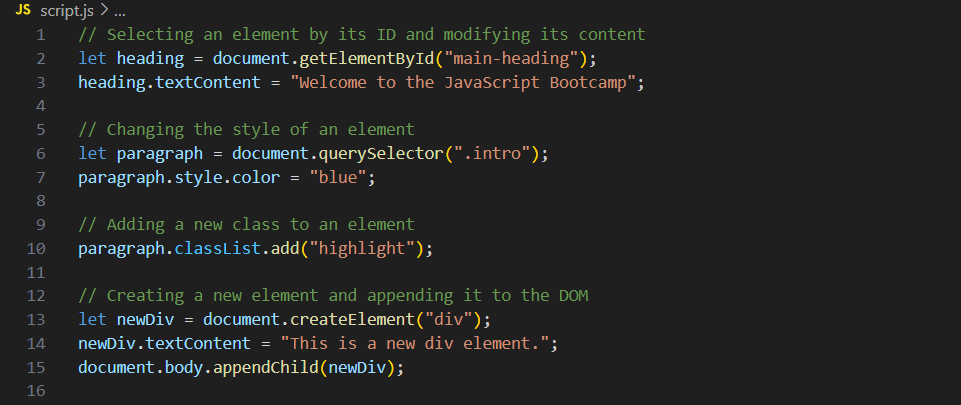
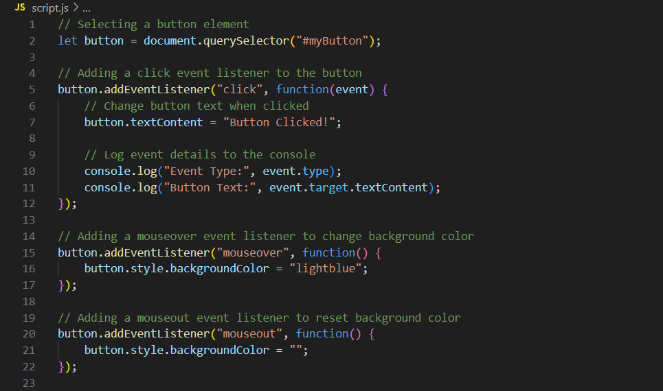
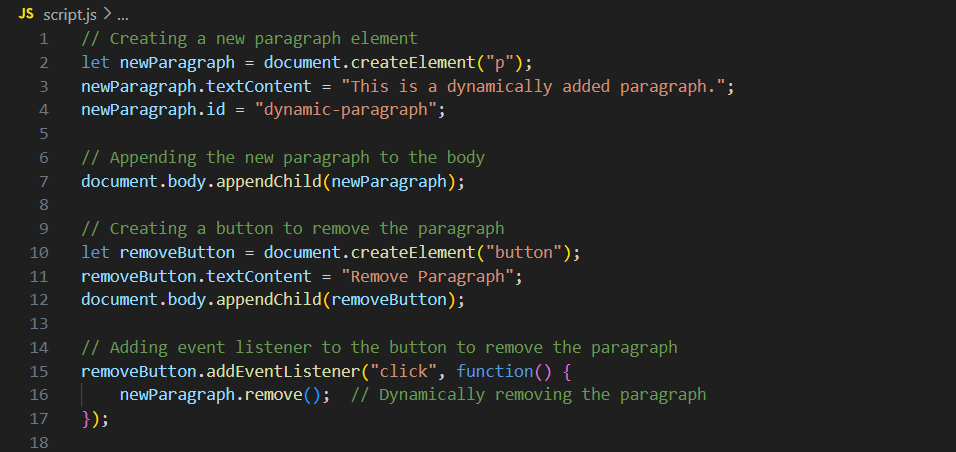

# Javascript
## Javascript Basics
### Variables and data types

#### Variables:
- It is a container that holds data values. 
- Allows you to store, update, and manipulate info throughout code

##### Declaring Variables:

- ```var```: function scope. Can be redeclared.
- `let`: block scope. Can be reassigned. Cannot be redeclared within the same scope.
- `const`: clock scope. Cannot be reassigned nor redeclared.

#### Data types:

- Define the type of data that a variable van hold.

##### Common Data Types: 

- Numbers: Used for numeric values
- Strings: A sequence of characters used to represent text.
- Booleans: Represents "true" or "false", normally used in conditions and logical operations.
- Arrays: A list of values, which can be any data type, stored in a single variable.
- Objects: Complex data structures that can hold multiple values and functions(methods) as properties.

### Operators and expressions

#### Operators:

- they are symbols or keywords used to perform operations on values(opperands).
- are the building blocks of expressions in JavaScript.

##### Types of Operators:

1. Arthmetic Operators:
- Used for mathematical calculations
- e.g : +, -, *, /, %(modulus), and  **(exponentiation).

2. Assignment Operators:
- Used to assign values to variables
- e.g: `=` (assign), `+=` (add and assign), `-=` (subtract and assign), `*=` (multiply and assign), `/=` (divide and assign)

3. Comparison Operators:
- Used to compare values and return a boolean(true or false)
- e.g: `==` (equal), `!=` (not equal), `===` (strict equal), `!===` (strict not equal), `>` (greater than), `<` (less than), `>=` (greater than or equal to), `<=` (less than or equal to)

4. Logical operators:
- Used to combine multiple conditions.
- e.g: `&&` (AND), `||` (OR), `!` (NOT)

5. Unary Operators
- Operate on a single operand.
- e.g: `++` (increment), `--` (decrement), `typeof` (type of operand).

6. Ternary Operator
- A shorthand for an if-else statement.
- Example: `condition ? expression1 : expression2`.

#### Expressions:

- A combination of values, variables, and operators that evaluates to a single value. Expressions can be simle(e.g a single value or variable) or complex(involving multiple operators and operands)

##### Types of Expressions:

1. Arithmetic Expressions
- Use arithmetic operators to perform calculations.
- e.g: `let total = price * quantity`;

2. Comparison Ecpressions:
- Use comparison operators to evaluate conditions.
- e.g: `let isAdult = age >= 18`;

3. Logical Expressions:
- Combine multiple conditions using logical operators
- e.g. `let canVote = (age>= 18) && (citizen === true);`

 
 #### Controle Structures(if-else, switch)

 ##### if-else Statements:
 
 - it is a fundamental control structure that executes a block of code if a specified condition is true. If the condition is false, the else block (if provided) is executed instead.
 
 1. Structure:

 - `if` Block: Executes when the condition is true.
 - `else if` Block: Optional; checks another condition if the previous one was false
 - `else `Block: Execute when none of the previous conditions are met.

 2. ` Use Case`: used when there are multiple conditions to evaluate, with different outcomes depending on which conditions are true 

 ##### switch Statements:

 - it is another control structure used for executing one block of code among many based on the value of an expression.
 - particularly useful when there are many possible conditions to check, and each corresponds to a specific case.

 1. Structure:

 - `switch` Keyword: Evaluares an expression and matches it to one of several case labels.
 - `case` Labels: Each case contains the code to execute if the expression matches the label.
 - `default` Case: Executes if no matching case is found; it's optional but often used as a fallback.

 2. Use Case: The switch statement is ideal when you need to compare a single expression against multiple potential values.

 ### Functions and scope
 
 #### Functions:
 - A reusable block of code designed to perform a specific task. Functions allow developers to write code once and use it multiple times, which enhances code effeciency and readability.

1. Function Declaration:
- can be declared using the function keyword, followed by a  name, a list of parameters are used within the function to perform operations. The actual values passed to the function are called arguments

2. Parameters and Arguments:
- Functions can take parameters
- Values that are passed into the function when it is called
- these parameters are used within the function to perform operations
- the actual values passed to the function are called arguments.

3. Return Value: 
- A function can return a value using the return statement. 
- can be used elsewhere in the code.

#### Scope:

- Deturmines the accessibility of variables and functions in different parts of the code.

##### Types of Scope:

1. Global scope:
- Variables declared outside of any function or block have global scope and can be accessed from anywhere in the code.

2. Local Scope:
- Variables declared within a function or block are local to that function or block and cannot be accessed from outside it

3. Function Scope:
- Variables declared within a function are accessible only within that function

4. Block Scope: 
- Variables declared with `let` or `const` within a block ({}) are accessible only within that block.

##### Hoisting:

- JavaScript variables and function declarations are "hoisted"
- they are moved to the top of their containing scope before code execution
- The value assignments are not hoisted, which can sometimes lead to unexpected behavior.

### DOM Manipulation

#### Selecting and modifying DOM elements

##### The DOM (Document Object Model):

- It is a structured representation of an HTML document.
- Represents the page so that programs can change the document structure, style and content.
- JavaScript could be used to manipulate the DOM, which enables developers to dynamically update the content and appearance of web pages.

##### Selecting DOM Elements:

- Targets specific parts of the HTML document so that they can be manipulated with JavaScript
- Methods for Selecting Elements:
1. ```getElementById```: Selects a single element by its unique id.
- ``const titleElement = document.getElementById("page-title")
console.log(titleElement)``

2. ```getElementsByClassName```: Selects all elements that share the same class name
- ``const famContacts = document.getElementsByClassName("family")
console.log(famContacts)``

3. ```getElementsByTagName```: Selects all elements with a specific tag name,

- ``const allContacts = document.getElementsByTagName('p')
console.log(allContacts)``


4. ```querySelector```: Selects the first element that matches a specified CSS selector.

- ``const firstWorkContact = document.querySelector('.work')
console.log(firstWorkContact)``

5. ```querySelectorAll```: Selects all elements that match a specified CSS selector.

- ``const allBtns = document.querySelectorAll('button')
console.log(allBtns)``

##### Modifying DOM Elements:

- Once elements are selected, they can be modified in various ways, such as changing their content, style, attributes, or structure
- Common Modifications:

1. Changing Content: Use the ```textContent``` or ```innerHTML``` properties to update the text or HTML inside an element. 
2. Changing Styles: Use the ```style``` property to modify the CSS styles of the an element (e.g., ```element.style.color = "blue"```;) 
3. Adding/Removing Classes: use ```classList.add, classList.remove```, or ```classList.toggle``` to manipulate an element's classes.
4. Channging Attributes: use "setAttribute" and "removeAttribute" to modify or remove attributes like ```src, href, alt```, etc.
5. Creating and Inserting Elements: use "createElement" and "appendChild" to create new elements and add them to the DOM.





#### Event handling 

##### What Are Events?

- an action or occurrence that happens in the browser such as a user clicking a button, typing in a field, or scrolling a page.
- enables interactive behavior on web pages

##### Event Listeners:

- the functions that wait for a specific event to occur on a particular element.
- when the event occurs, the event listener "listens" for it and triggers a callback function -- a function designed to execute when the event occurs.

- Attaching Event Listeners:

1. ```addEventListener```: this is the most common method for attching an event listener to an element. It takes two arguments: the event type (e.g "click", "mouseover", "keydown") and the callback function to execute when the event occurs.
2. Inline Event Handlers: Can be directly placed within HTML tags (e.g., ```<button onclick = "doSomething()">```). However, using ```addEventListener``` is prefered as it seperates HTML and JavaScript, making coding more modular and easier to maintain. 

##### Common Event Types:

1. Mouse Events
- Triggered by mouse actions.
- e.g., ```click```, ```dblclick```(double-click), ```mouseover```, ```mouseout```, ```mousedown```, ```mouseup```.

2. Keyboard Events: 
- Triggered by keyboard actions.
- e.g., ```keydown```, ```keyup```, ```keypress```.

3. Form Events:
- Trigered by form-related actions
- e.g., ```submit```, ```change```, ```focus```, ```blur```.

4. Document/ Window Events:
- Triggered by actions related to the document or window.
- e.g., ```load```, ```resize```, ```scroll```, ```DOMContentLoaded```

##### Event Object:

- When an event occurs, the browser passes an event object to the event handler function. This object contains information about the event, such as the type of event, the elememt that triggered it, and other details like mouse coordinates for mouse events or key codes for keyboard events. 
- Using the event object: Can be accessed by adding a parameter to the callback function which allows the developer to prevent default actions, stop the event from propagating(bubbling up to parent elements), and access event-specific properties.




#### Creating and removing elements dynamically

##### Creating Elements Dynamically:

- it involves using JavaScript to generate new HTML elements that can be added to the DOM, allowing web pages to adapt in real-time to user actions or data changes.

- Steps to Create Elements: 

1. ```createElement``` :  Use this method to create a new element. It accepts the tag name of the element you want to create
2. Set Attributes/ Content: After creating a new element, you can set its attributes(like `id`, `class`, or `src`) and its content (using `textContent` or `innerHTML`) 
3. Append to the DOM: Finally, use methods like `appendChild`, `insertBefore`, or `append` to add the newly created element to the DOM at the desired location.

##### Removing Elements Dynamically

- involves deleting existing elements from the DOM using JavaScript, which can help clean up the document in response to user actions, like closing a popup or deleting an item from a list

- Methods to Remove Elements: 
 
1. `removeChild`: removes a child element from its parent. You first need to select the parent element and then call `remeoveChild` with the element you wish to remove.
2. `remove`: directly removes the selected element from the DOM, without needing to reference its parent.

###### Practical Applications:

1. Adding Dynamic Content:
- Use dynamic element creation to add new items to a list, build forms on the fly, or generate entire section of a webpage base on user input or data from an API.

2. Interactive UI Elements: 
- Use dynamic element removal to close modals, delete items, or manage a user interface that adapts to user interactions.


